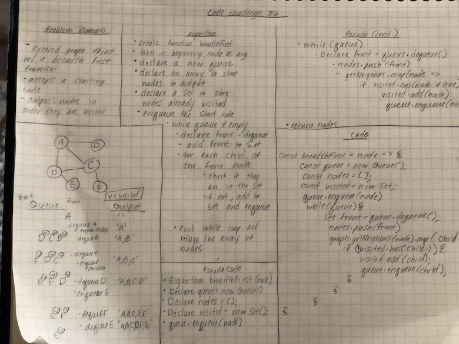

# Graphs
* Create a graph with methods for addNode, addEdge, getNodes, getNeighbord, and size
* Create a breadth first traversal

## Challenge
* Implement your own Graph. The graph should be represented as an adjacency list, and should include the following methods:

* AddNode()
 
  * AddEdge()

  * GetNodes()

  * GetNeighbors()

  * Size()
  
  * BreadthFirst

## Approach & Efficiency
* I only used one class of Graph.  Within my constructor I created a Map
* addNode will createa  new entry in the map with the node value and an empty array for the edges
* addEdge: if there is nothing in the map, return null. If there is no weight, just add the edge to the edge array.  If there is a weight, add the weight in the array.
* getNodes: finds all the keys in the map and spreads them into an array
* getNeighbors: calls .get(node) on the map, which gives the array of edges
* size: returns the number of entries in the map
* breadthFirst: Space: O(3n) or just O(n). Time: O(n^2)

## API
* addNode()
  - Adds a new node to the graph
  - Takes in the value of that node
  - Returns the added node
* addEdge()
  - Adds a new edge between two nodes in the graph
  - Include the ability to have a “weight”
  - Takes in the two nodes to be connected by the edge
  - Both nodes should already be in the Graph
* getNodes()
  - Returns all of the nodes in the graph as a collection (set, list, or similar)
* getNeighbors()
  - Returns a collection of edges connected to the given node
  - Takes in a given node
  - Include the weight of the connection in the returned collection
* size()
  - Returns the total number of nodes in the graph
* breadthFirst()
  - Traverses a graph breadth first, returning an array of all the nodes in order
  
