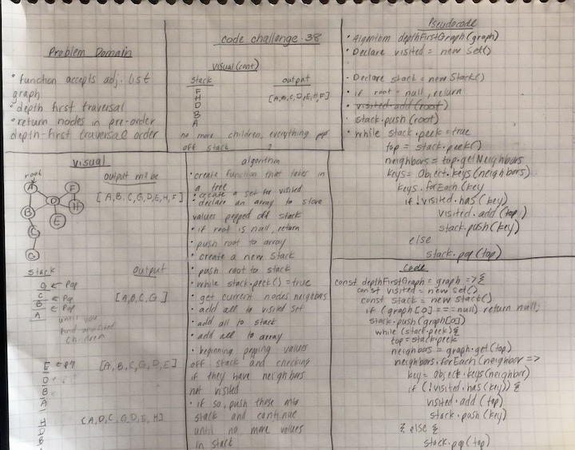

# Depth First Graph Traversal
* Travers a graph using a depth-first pre-order traversal

## Challenge Description
* Create a function that accepts an adjacency list as a graph, and conducts a depth first traversal. Without utilizing any of the built-in methods available to your language, return a collection of nodes in their pre-order depth-first traversal order.

## Approach & Efficiency
* Time Complexity: 
* Space Complexity: 

## Solution
