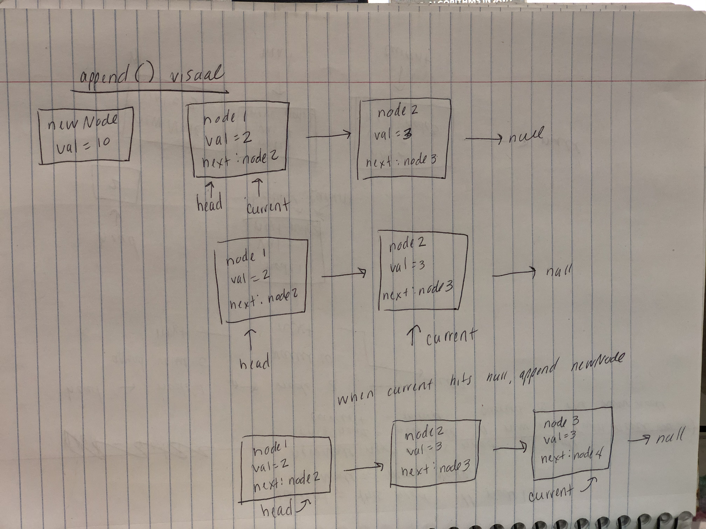
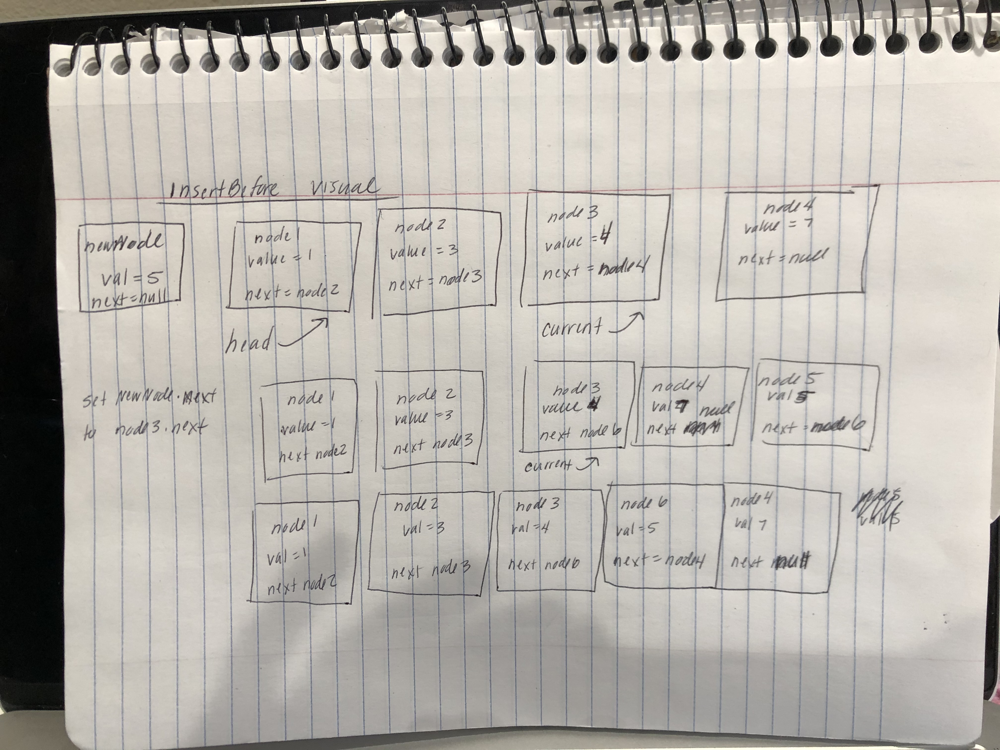
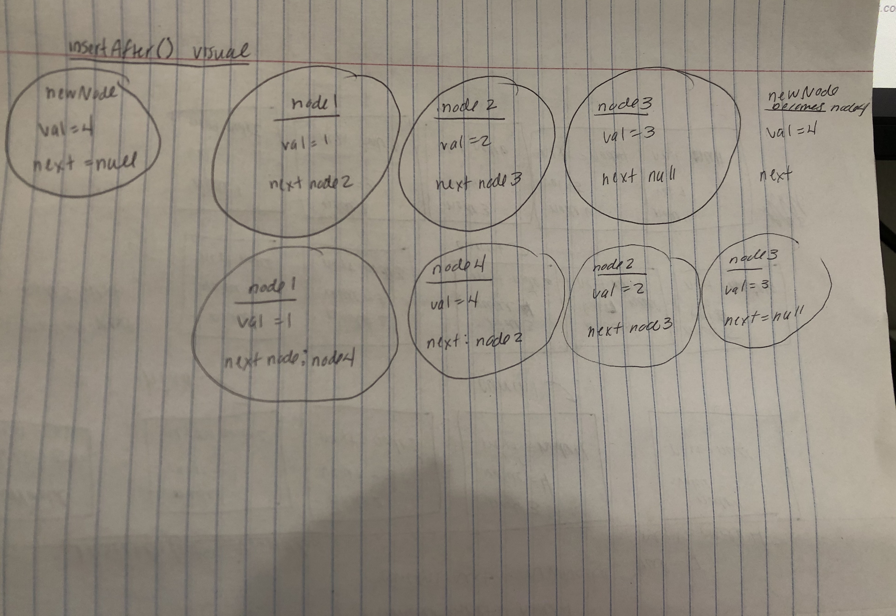
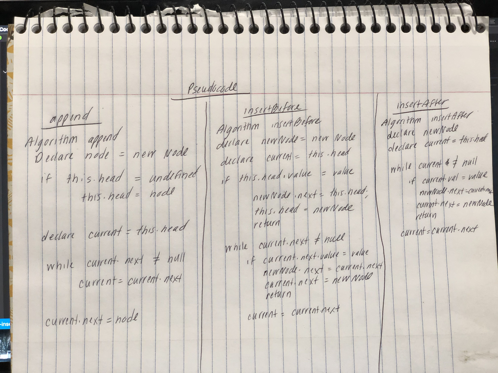
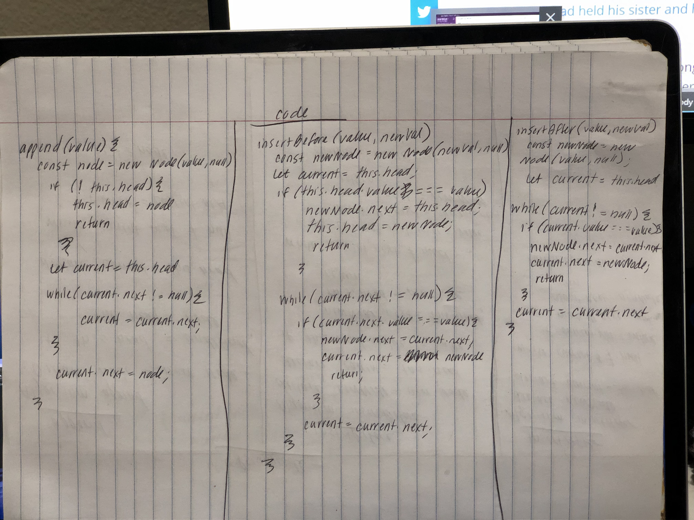
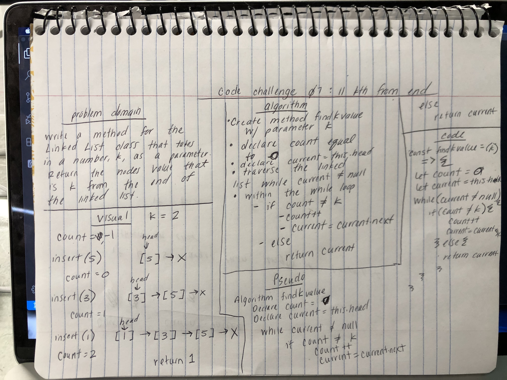

# Singly Linked List
- Create a Node and LinkedList class that can handle a singly linked list.

## Challenge
- Create a Node and LinkedList CLass.  Withink the LinkList class created the following methods: insert(), include(), and toString().
- Extend the LinkList to include the methods append(), isertBefore(), and insertAfter()
- ll kth from end: write a method for the Linked List class that takes in a number, k, as a parameter. REturn the nodes value that is k from the end of the linked list.

## Approach & Efficiency
Big O:
- insert: O(1)
- includes: O(n)
- toString: O(n)
- append: O(n)
- insertBefore: O(n)
- insertAfter: O(n)
- findKthValue: O(n)

## API
- insert: takes in a value and adds a new node with that value to the head
- includes: takes a value in as an argument and returns a boolean result depending on whether that value exists in the linked list
- toString: takes in no arguments. It returns a string representing all the values that exist in a linked list formatted as "{ a } -> { b } -> { c } -> NULL"
- append: insert a value at the end of the linked list
- insertBefore: takes in a value and new value.  Inserts the new value before the given value
- insertAfter: takes in a value and new value. Inserts the new value after the given value.
- findKthValue: takes in value k, and, starting from the end of the linked list, finds that place in the linked list and returns the value

## Whiteboard for linked list insertions challenge:

 
 
 
 
  
 
 