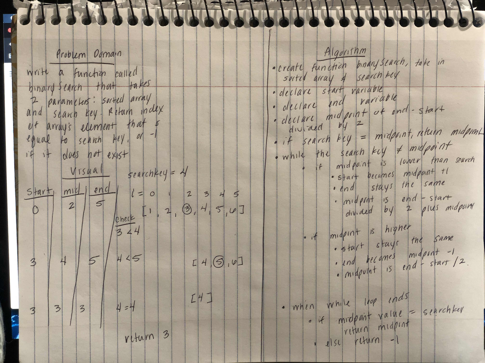
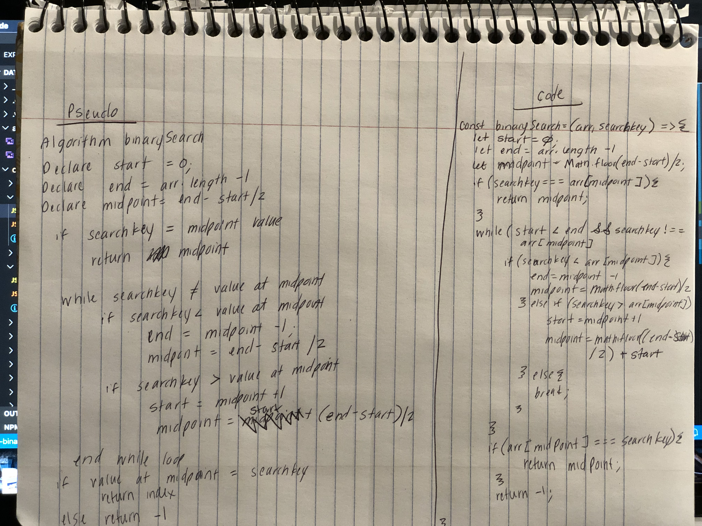

# Binary Search
* When given a sorted array find a given number.

## Challenge
Write a function called BinarySearch that takes in 2 parameters: a sorted array and the search key. Return the index of the matching number.  If no match is found, retur -1.

## Approach & Efficiency
* I declared an end, start, and midpoint variable.
* I created a while loop that continues to run until the midpoint value equals the search key or the end value equals the start value.  The reason toe check for if end = value is that the while loop will continue to run if you are given a value that does not exist within the array.
* Within the while loop the end, start, and midpoint values are adjusted depending on whether or not the searchkey is found.
* once end = start or search key is found, the while loop breaks.  Equivalency is check once more.  If it is not equivalent, it returns -1.
* Big O: O(n)

## Solution

