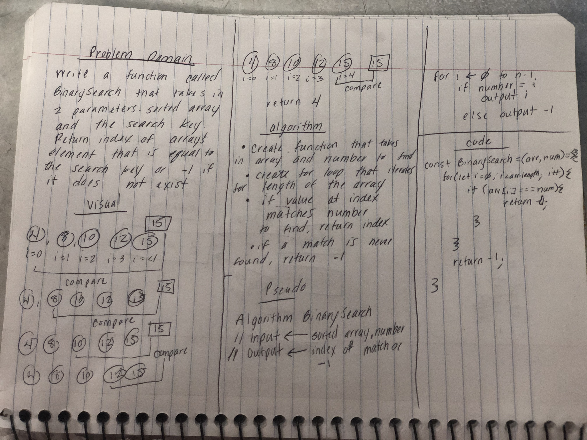

# Binary Search
* When given a sorted array find a given number.

## Challenge
Write a function called BinarySearch that takes in 2 parameters: a sorted array and the search key. Return the index of the matching number.  If no match is found, retur -1.

## Approach & Efficiency
* I used a for loop to compare the number to the values in the array.
* Inside of the for loop I I wrote an if statement that will return the index of the number if there is a match
* outside of the for loop I put return -1, which will only execute if no match is found

## Solution
