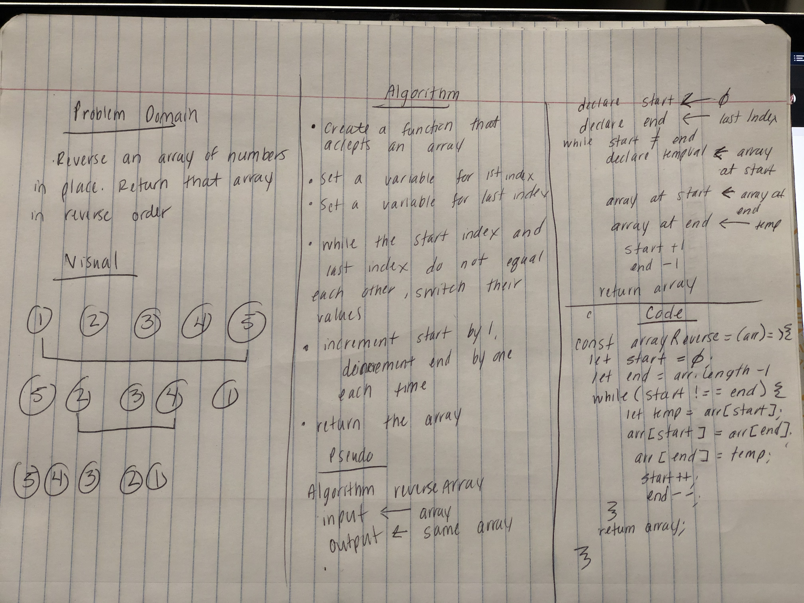
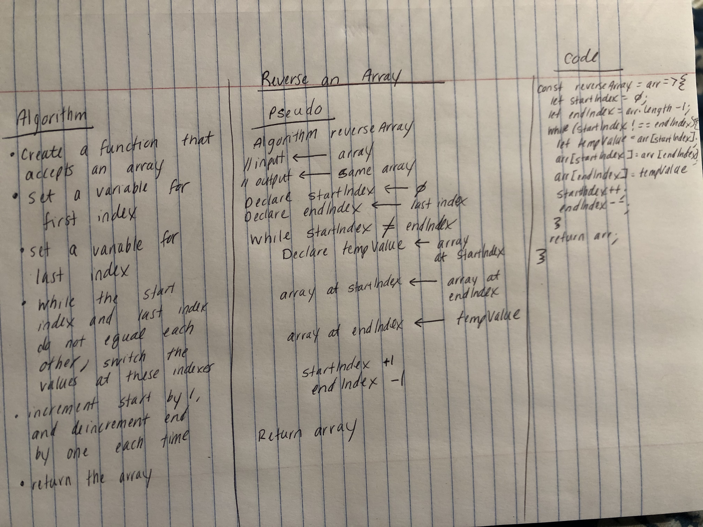

# Reverse an Array
When given an array, write a function to reverse the array.

## Challenge
Write a function called reverseArray which takes an array as an argument. Without utilizing any of the built-in methods available to your language, return an array with elements in reversed order.

## Approach & Efficiency
* I decided to use a while loop to reverse the array. I tracked the start index and the index and while they're not equal to each other, it will continue to run.  
* Each time the while loop is run through, it will increment the start index, and deincrement the end index.

## Solution

