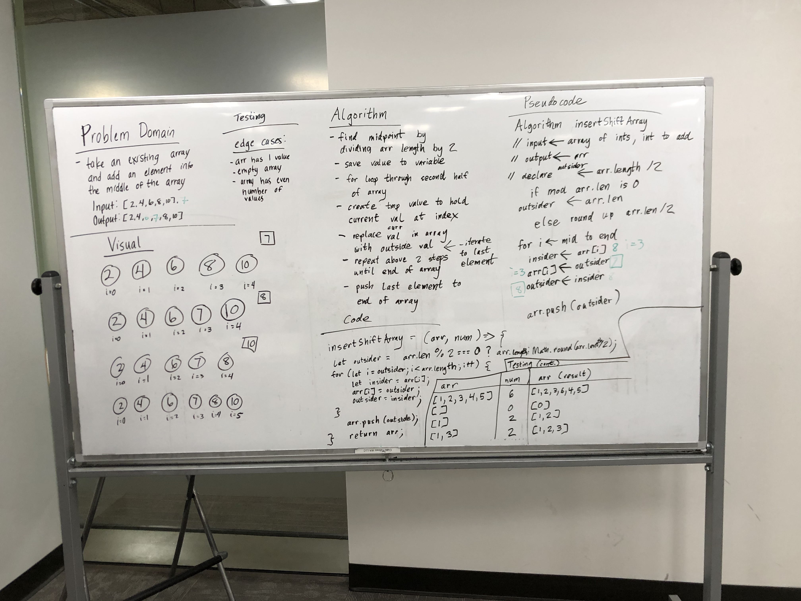

# Shift an Array
Take an existing array and insert a given number into the middle of that array.

## Challenge
Write a function called insertShiftArray which takes in an array and the value to be added. Without utilizing any of the built-in methods available to your language, return an array with the new value added at the middle index.

## Approach & Efficiency
* First, I had to set a variable outside of the function to store the number to be inserted
* Second, I had to find the midpoint of the array for both an even or odd length array.  This will tell the for loop where to start.
* I created a for loop to begin inserting numbers at the midpoint.  Before inserting, I would store the current number at the midpoint, hold it in a variable, and then replace it.
* That temp number would then be store as the next number to be inserted into the next place in the array.
* Once you exit the for loop, the last temp number is pushed onto the end of the array.
  

## Solution

