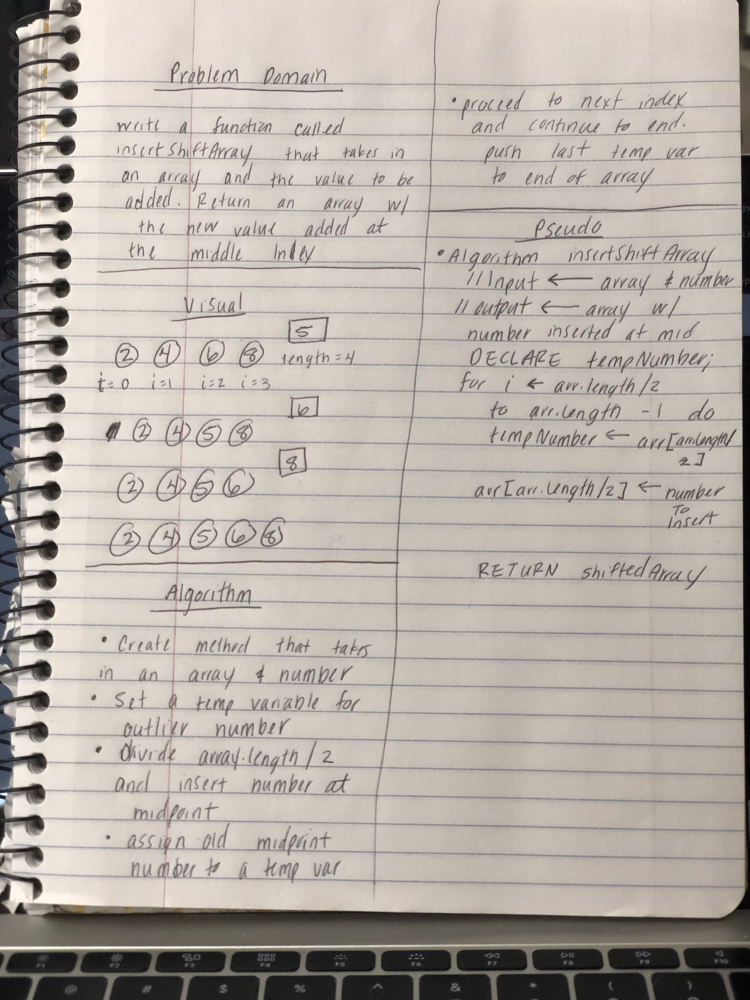

# Shift an Array
Take an existing array and insert a given number into the middle of that array.

## Challenge
Write a function called insertShiftArray which takes in an array and the value to be added. Without utilizing any of the built-in methods available to your language, return an array with the new value added at the middle index.

## Approach & Efficiency
* Our class worked out this problem together on a whiteboard.  While working through the problem in VSCode I found some issues with the code we wrote, but for the most part we were on the right track.
* I started by writing my tests for insertShiftArray.  I created a test for an even and odd number of values within the array.  I also accounted for when you're given an empty array and an array with just one value.
* Once my tests were in place, I started writing my function. 
  * I created a separate function to help find the midpoint of an array.  
  * The for loop was started from the midpoint and proceded to increment to the end of the array
  * I created a variable to hold the current number to be inserted into the array and a variable for the next number to be inserted into the array.
  * Once the for loop was completed, the last value had to push into the array because the length of the array was increasing by one and therefore the for loop wouldn't run for as long as needed to complete the problem.

## Solution

