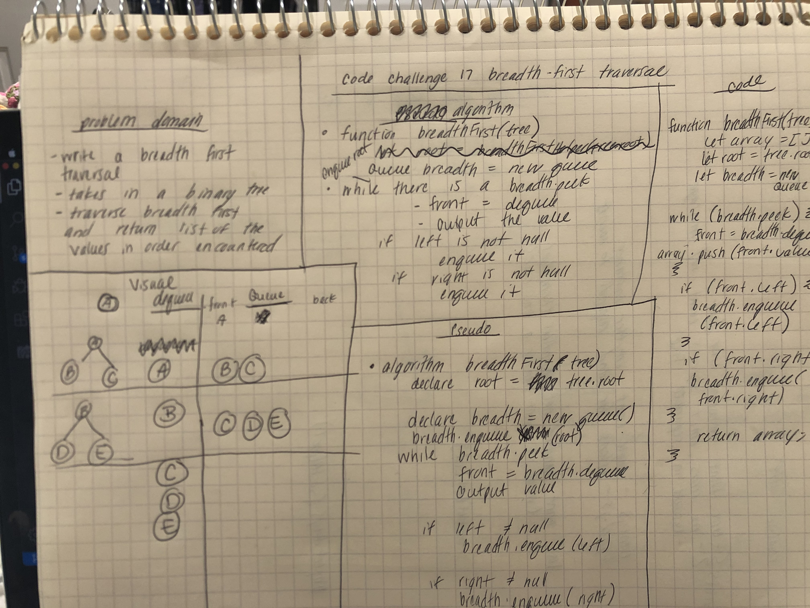

# Breadth First Traversal
* Write a breadth first traversal
## Challenge Description
* Write a breadth first traversal method that takes a Binary Tree as its unique input.  Traverse the input tree using a breadth-first approach and return a list of the values in the tree in the order they were encountered.

## Approach & Efficiency
* Space: O(n)
* Time: O(n)

## Solution
