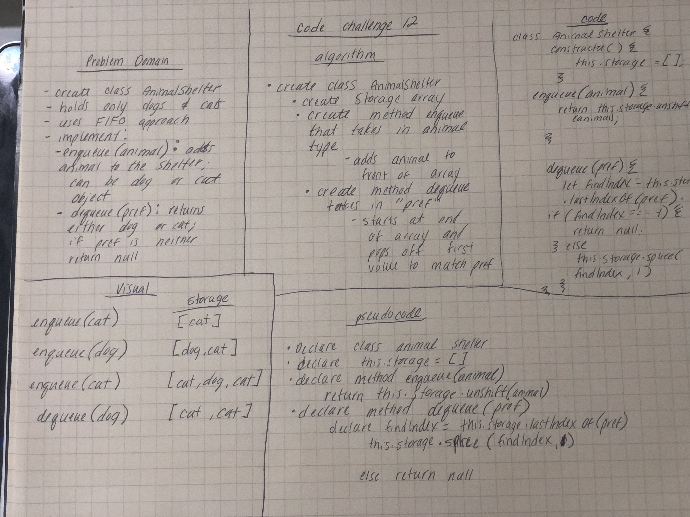

# FIFO Animal Shelter
* Create a class called Animal shelter with methods enqueue and dequeue

## Challenge Description
* Create a class AnimalShelter which holds only dogs and cats. Operates using a First-in, First-Out approach.
* Implement enqueue(anima). Adds an animal to the shelter, can be either a cat or dog.
* Implement dequeue(pref). Returns either a dog or a cat.  If they are not a cat or dog, return null.

## Approach & Efficiency
* I haven't solved this problem at this time. 

## Solution
 