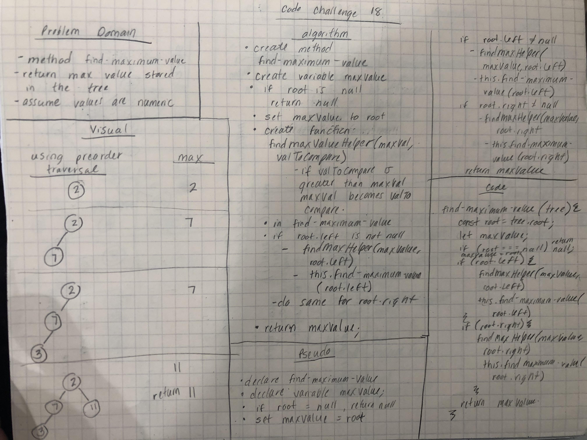

# Find Maximum Binary Tree
* Find the maximum value in a binary tree

## Challenge Description
* Write an instance method called find-maximum-value. Without utilizing any of the built-in methods available to your language, return the maximum value stored in the tree. You can assume that the values stored in the Binary Tree will be numeric.

## Approach & Efficiency
* Time: O(n), it looks at each node once
* Space: O(2n)

## Solution
