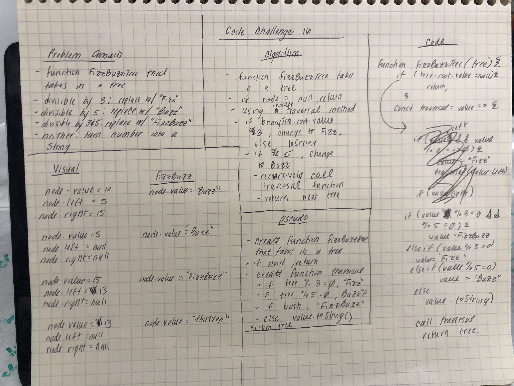

# FizzBuzzTree
* Write a function that takes in a tree and converts the values to Fizz, Buzz, FizzBuzz, or toString depending on if they are divisible by 3 and/or 5.

## Challenge Description
* Write a function called FizzBuzzTree which takes a tree as an argument.
* Without utilizing any of the built-in methods available to your language, determine whether or not the value of each node is divisible by 3, 5 or both. Create a new tree with the same structure as the original, but the values modified as follows:
  - If the value is divisible by 3, replace the value with “Fizz”
  - If the value is divisible by 5, replace the value with “Buzz”
  - If the value is divisible by 3 and 5, replace the value with “FizzBuzz”
  - If the value is not divisible by 3 or 5, simply turn the number into a String.
* Return the new tree.
## Approach & Efficiency
* I created an inOrder traversal within my fizzBuzzTree function. Withink that traversal I converted the values to the appropriate string depending on if the value is divisble by 3 and/or 5
*  Time: O(n), it looks at each node once
* Space: O(2n)

## Solution

