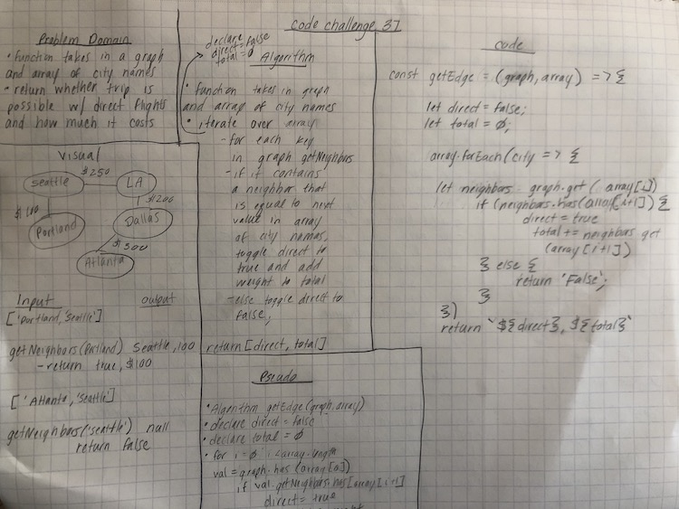

# Get Edge
* Create a method that returns whether a trip is possible with a direct flight and what it will cost

## Challenge Description
* Write a function based on the specifications above, which takes in a graph, and an array of city names. 
* Without utilizing any of the built-in methods available to your language, return whether the full trip is possible with direct flights, and how much it would cost.

## Approach & Efficiency
* Time: O(n^2)
* Space: O(1)

## Solution
 