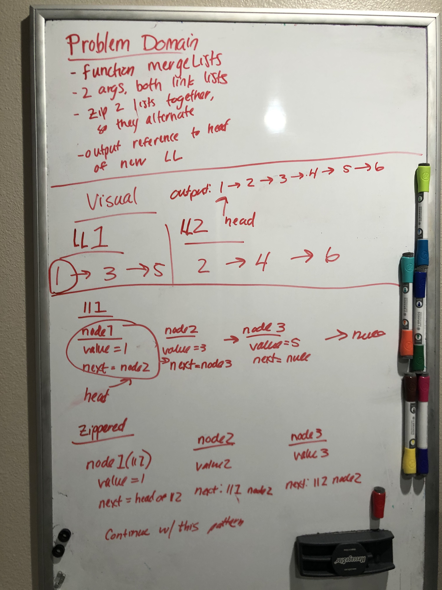
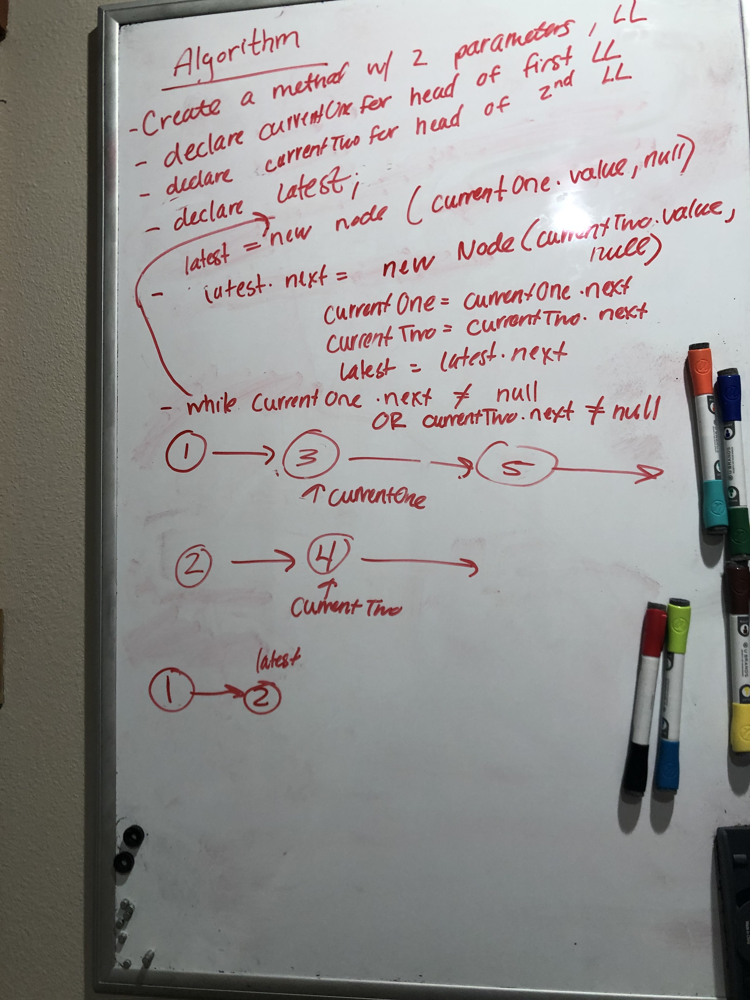

# Merge Two Linked Lists
* Create a functin that takes in 2 linked lists as arguments and merges them together

## Challenge Description
* Write a function called mergeLists that takes in two linked lists as arguments. Zip the two lists together into one so that the nodes alternate between the two lists and return a reference ot the head of the zipped list.

## Approach & Efficiency
* I attempted to create 2 variables, each one pointing to a head in the 2 linked lists.
* I declared a variable to track the latest value in the new linked list
* I set a while loop that continues to execute while either of the 2 linked lists are not equal to null
* within the while loop I assign latest to a new node that sets the linked list One head value within it.
* I  then set latest.next to a new node with the linked list Twos head value
* I then reassign each of those linked list one and linked list two values to their next value
* I then set latest to equal latest.next 

## Solution

