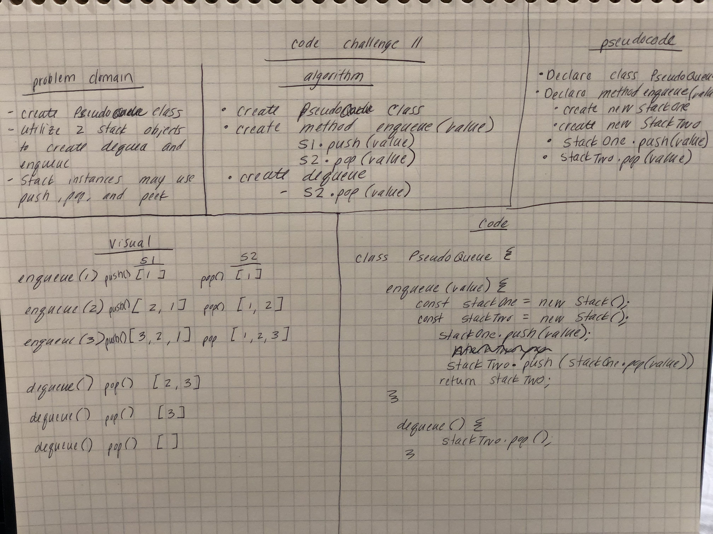

# Queue with Stacks
Implement a Queue using two stacks

## Challenge Description
Created a class called PseudoQueue.  Use 2 stack objects to implement the queues enqueue and dequeue methods.  You can use the stacks push, pop, and peek methods to do so.

## Approach & Efficiency
* I'm using stackOne to push all of the enqueue values
* I plan in dequeue to add all the values to stackTwo, pop off the value I want to dequeue, then re-push all the values back onto stackOne.  That way if I need to enqueue another item, they will all be ther in stackOne in the appropriate order.

## Solution
 
