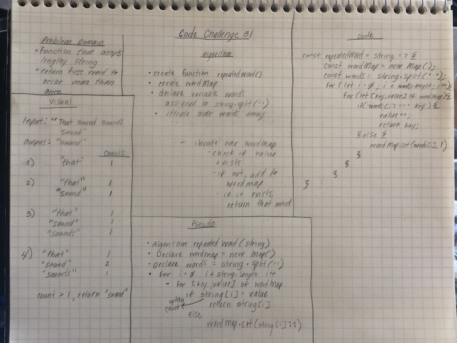

# Repeated Words
* Given a string of words, return the first repeating word in the sentence

## Challenge Description
* Write a function that accepts a lengthy string parameter.
* Without utilizing any of the built-in library methods available to your language, return the first word to occur more than once in that provided string.

## Approach & Efficiency
* Time Complexity: O(n)
* Space Complexity: O(n)

## Solution
