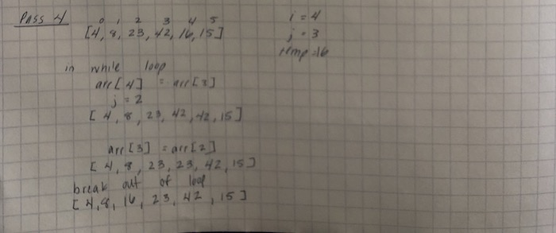

### Insertion Sort

* Today I'm going to explain Insertion Sort through the help of a step-by-step visual aid.  

* First, a look at the Pseudocode that we'll be walking through.

 

 * Each "pass" is one iteration of the for loop

 * Pass One
   - In pass one we will be starting at index 1, pulling out the value at the index, 4, and setting it for the temp.
   -  We pass the conditions to get into the while loop.
   - In the while loop, we set the value at index 1 to become the value at index 0 (8).
   - This gives us an array of [8, 8, 23, 42, 16, 15]
   - We decrement j down to -1, breaking us out of the while loop.
   - Now that we are out of the while loop, we set the value at index 0 to be 4.  Giving us [4, 8, 23, 42, 16, 15]
  

  * Pass Two & Pass Three

    - Because the values at arr[2] and arr[3] are not smaller than the value that precede them, we do not enter the while loop and make no changes to the array.

* Pass Four

  - The value at arr[4] (16) is less than the value at arr[3] (42), causing us to enter the while loop.
  - We iterate through the while loop 3 times before we are eventually able to insert the temp value of 16 at arr[2].
  

* Pass Five
  - Our temp value of 15 is less than the value of 42 at arr[4]. We enter the while loop.
  - We continue to insert the larger numbers into the next index, bumping them up in the array to make way for our eventual insertion of 15.
  - At arr[1] we are finally able to break out of the while loop because 8 is not bigger than 15.
  - 15 is inserted at arr[2].

  

* Our array is now completely sorted!

