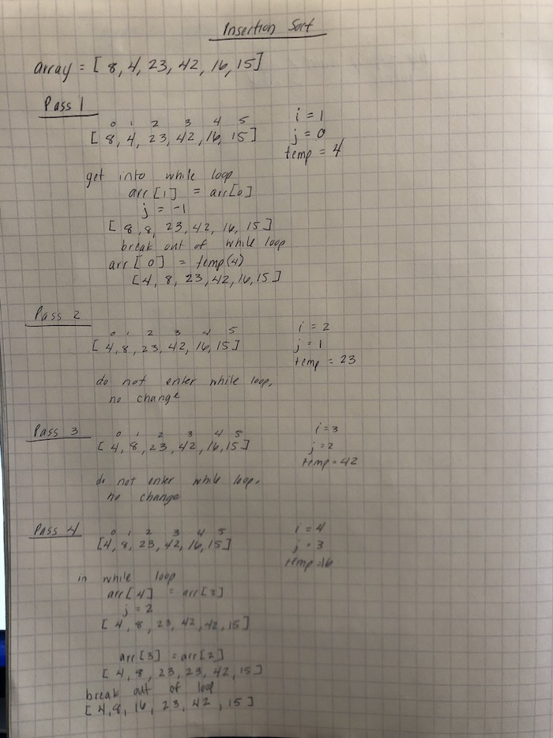
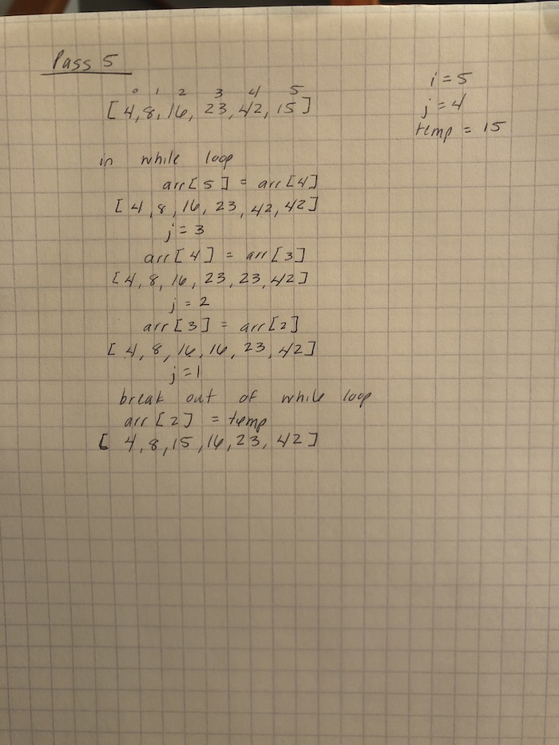

# Insertion Sort
* Create a function that sorts an array using insertion sort.

## Challenge Description
* Review the pseudocode below, then trace the algorithm by stepping through the process with the provided sample array. Document your explanation by creating a blog article that shows the step-by-step output after each iteration through some sort of visual.

* Once you are done with your article, code a working, tested implementation of Insertion Sort based on the pseudocode provided.

## Approach & Efficiency
Time: O(n^2)
Space: O(1)

## Solution

