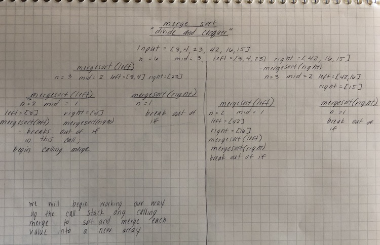
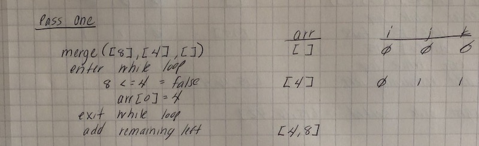
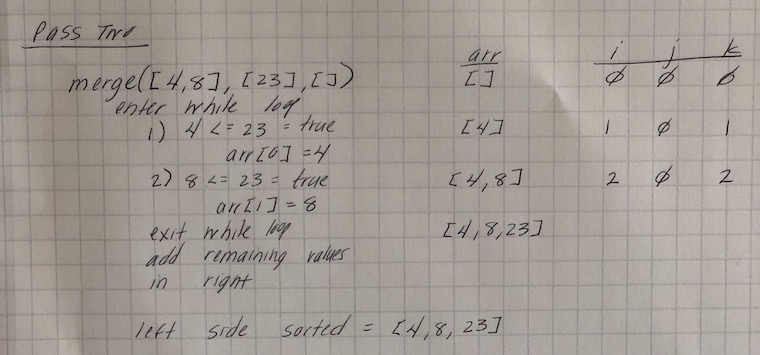
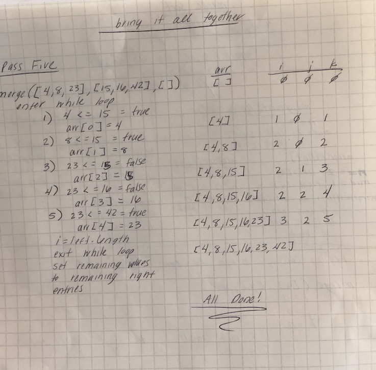

### Merge Sort
* Today we're going to learn how to do an insertion sort.
* An insertion sort involves the use of 2 alorithms: mergeSort and merge
* The first algorithm that we're going to look at is mergeSort.  This algorithm will help us to break our array down into single "nodes" using recursion.

* First, let's look at the Pseudocode for mergeSort:
 
 

 * Using this algorithm recursively, we will break down each part of the array into individual parts.

* As you can see, each side, branches into smaller parts.  

* Let's look at the left side first:

* On the left side, we begin with an array of [8, 4, 23]
* This is further broken down to a left and right of [8, 4] and [23]
* This new left side is then broken down into [8] and [4]

* We then proceed to do the same thing on the right side of our original array

* We have an array of [42, 16, 15]
* This is broken down into a left array of [42, 16] and a right of [15]
* We then break down the left side into a left and right of [42] and [16]

### Useing algorithm merge
 * Now that we're down to the individual nodes, lets take a look at the pseudocode for merge:

 

 * We will begin at the top of our call stack and make our way back to a complete and sorted array.

 * Each "pass" refers to a single call of the merge algorithm

 
 * In pass one we begin at the "bottom" of our left side that we broke down into individual pieces. 
 * We then proceed to iterate through the arrays, comparing their values.  If the left value is larger than the right, we proceed to enter the right value into the new array and increment j and k.
 * If the left value is smaller, it will be added to the array and i and k will be increment.

  

  * We proceed in the same manner for pass two and eventually have the left side of our original array completely sorted.

   
   * In pass three we begin to sort the right side of our original array.

   
   * Pass four completes the sorting of the right side.

   
  * Pass five is where we finally bring it all together.  The entirety of the left and right are merged together, resulting in a new sorted array!
  
  