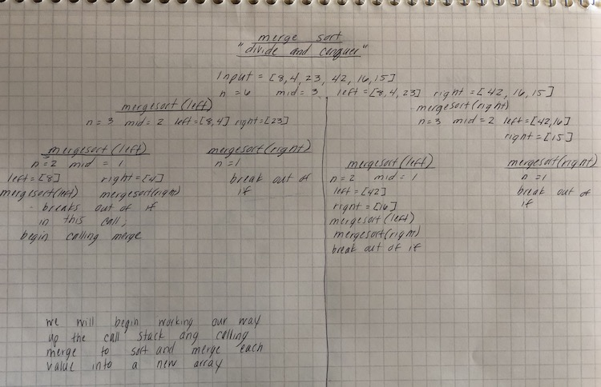
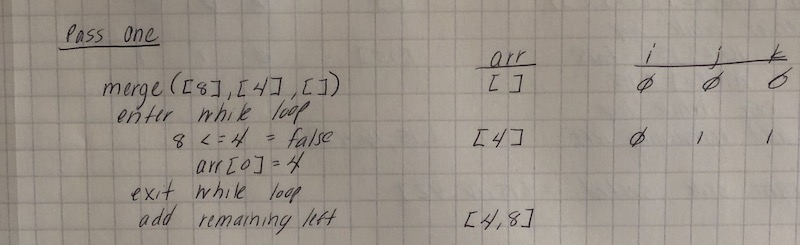
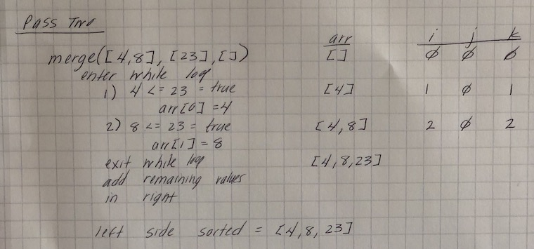
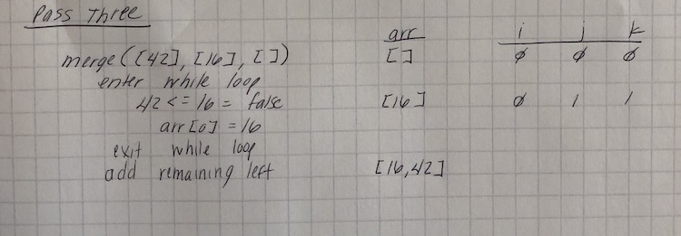
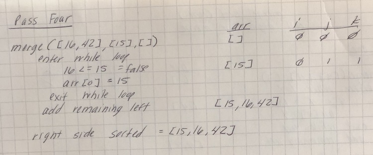
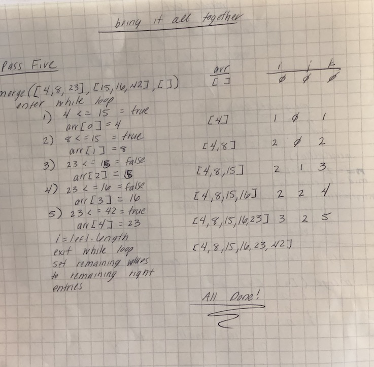

# Merge Sort
* Using a merge function and mergeSort function, return a new sorted array using merge sort.

## Challenge Description
* Provide a visual step through for each of the sample arrays based on the provided pseudo code
* Convert the pseudo-code into working code in your language
* Present a complete set of working tests

## Approach & Efficiency
Time: O(log n)
Space: O(n)

## Solution

