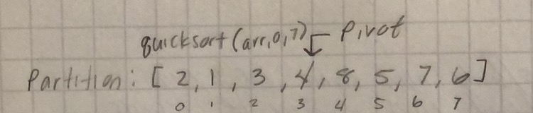

#### How To Quicksort

* Today I'll step you through quick sort
* First, our pseudocode

* The quickSort function calls partition.  Within partition a "pivot" is created.  Using this pivot, we then call our swap function to swap numbers based on the pivot.  

* Let's start with an example.  We will look at the recursive calls of just the left side of our array for this exercise:

* As you can see, we will call quickSort recursively to continue branching our function out into "nodes".  We then stop recursion and swap our values.  One thing to note is that this is all being done in place, rather than creating new arrays like we did in merge sort.

* In our first call of quicksort we set the pivot to be 4.  

* This will set 4 into the middle of our array, with all values to the left being less than 4 and all values to right being greater than 4.

* We make another call to quickSort with the left side of our array. Pirot is set to 3.  Since both 1 and 2 are less than 3, no change occurs.

* We make another call to quicksort with the values of [1,2]. 2 is the pivot and no change is made
* One last call is made to quickSort with [2].  No change is made.

* Source: https://www.youtube.com/watch?v=COk73cpQbFQ